# 유튜브 자동 업로드 설명서

매번 studio.youtube.com 에 들어가 올리는 대신, **스크립트가 YouTube Data API 로 영상을
올리고 예약 공개까지 걸어 두게** 만드는 전 과정을 다룬다. 구글 클라우드 설정 0원에서 시작해
→ 채널 토큰 발급 → 업로드 스크립트 → 매일 자동 실행 → 결과 확인까지, 화면을 보며 따라 할 수
있게 단계별로 쓴 범용 설명서다.

**준비물**: 채널을 소유한 구글 계정 · Python 3.9+ · 브라우저가 있는 컴퓨터 (토큰 발급 때 1회).

> **그림에 대하여** — 화면은 **실제 스크린샷**(2026년 8월, 한국어 UI 기준)이다. §5 의
> 계정·채널 목록 등 개인 정보는 흐림 처리했고, §2 의 메뉴 이동 그림과 §5-4 터미널 출력만
> 재현 그림이다. 빨간 번호 ①②③이 클릭·입력 지점이고, 구글이 UI 를 바꾸면 문구·배치는
> 조금 다를 수 있지만 **흐름과 입력값은 동일**하다.

---

## 목차

- [§0 큰 그림 — 자동 업로드는 이렇게 돈다](#0-큰-그림--자동-업로드는-이렇게-돈다)
- [§1 Google Cloud 프로젝트 만들기](#1-google-cloud-프로젝트-만들기)
- [§2 YouTube Data API v3 켜기](#2-youtube-data-api-v3-켜기)
- [§3 OAuth 동의 화면 구성](#3-oauth-동의-화면-구성)
- [§4 OAuth 클라이언트 ID 만들기 (데스크톱 앱)](#4-oauth-클라이언트-id-만들기-데스크톱-앱)
- [§5 채널 refresh token 발급](#5-채널-refresh-token-발급)
- [§6 자격증명 보관 (.env)](#6-자격증명-보관-env)
- [§7 업로드 스크립트와 자동화](#7-업로드-스크립트와-자동화)
- [§8 결과 확인 (YouTube Studio)](#8-결과-확인-youtube-studio)
- [§9 문제 해결](#9-문제-해결)
- [부록 A 토큰 발급 스크립트 (get_token.py)](#부록-a--토큰-발급-스크립트-get_tokenpy)
- [부록 B 쿼터 계산](#부록-b--쿼터-계산)

---

## §0 큰 그림 — 자동 업로드는 이렇게 돈다

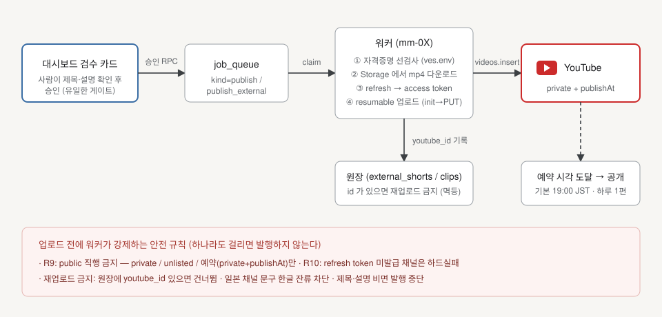

자동 업로드에 필요한 부품은 셋이다:

1. **GCP 프로젝트 + OAuth 클라이언트** (§1~§4) — "이 앱이 유튜브 API 를 쓴다"는 신분증.
   `client_id` / `client_secret` 한 쌍.
2. **채널 refresh token** (§5) — "이 채널이 이 앱에 업로드를 허용했다"는 영구 허용장.
   브라우저에서 **한 번만** 허용을 눌러 발급받고, 그 뒤로는 사람 없이 쓴다.
3. **업로드 스크립트 + 스케줄러** (§7) — refresh token 으로 1시간짜리 access token 을
   그때그때 만들어 resumable 업로드를 하고, cron 이 매일 정해진 시각에 스크립트를 돌린다.

용어 세 개만 구분하면 나머지는 기계적이다:

| 용어 | 무엇 | 수명 | 어디에 |
|---|---|---|---|
| `client_id` / `client_secret` | 앱의 신분증 (§4) | 영구 (직접 삭제 전까지) | `.env` |
| **refresh token** | 채널의 허용장 (§5) | 영구* — 노드에 저장하는 것 | `.env` |
| access token | 1시간짜리 출입증 | 1시간 | 저장 안 함 — 매번 새로 발급 |

\* 단, OAuth 동의 화면이 '테스트' 상태면 **7일 만에 만료**된다 — §3 의 함정.

**운영 원칙** — 사고를 미리 막는 네 가지:

- `public` 직행 대신 **`private` 또는 예약 공개**(`private` + `publishAt`)로 올려서,
  확인 후 공개되게 한다. 자동화가 잘못 돌아도 시청자에게 노출되기 전에 잡을 수 있다.
- 업로드 1건 = 쿼터 **1,600단위**. 기본 쿼터(10,000/일)로는 **하루 약 6편**이다 (부록 B).
- refresh token 은 **비밀번호와 같다** — 레포 커밋·채팅·화면 공유에 노출 금지.
- 업로드 완료한 파일은 옮기거나 기록을 남겨 **같은 영상이 두 번 올라가지 않게** 한다.

---

## §1 Google Cloud 프로젝트 만들기

유튜브 업로드 API 는 구글 클라우드 "프로젝트"에 속한 OAuth 클라이언트로만 부를 수 있다.
**프로젝트 = 쿼터의 단위**이기도 하다(하루 약 6편, 부록 B) — 채널·물량이 많아지면
프로젝트를 나누게 된다.

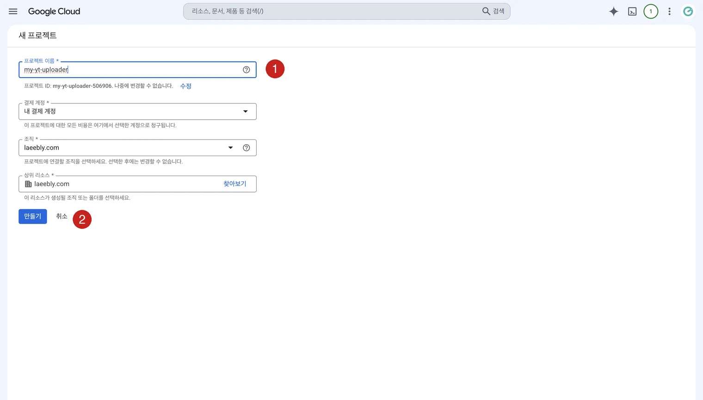

*새 프로젝트 화면 — ① 프로젝트 이름 입력(이름 아래 자동으로 잡히는 프로젝트 ID 는 나중에 못
바꾼다) ② 만들기. 캡처는 조직(Workspace) 계정이라 결제 계정·조직 필드가 보인다 — 개인 @gmail
계정이면 위치가 '조직 없음'으로만 뜬다.*

1. 채널을 소유한 구글 계정으로 <https://console.cloud.google.com> 에 로그인한다.
   처음이면 약관 동의 화면이 한 번 뜬다. (결제 등록 없이도 이 문서의 전 과정이 된다 —
   YouTube Data API 는 무료 쿼터제다.)
2. 상단 바 왼쪽의 **프로젝트 선택 ▾** 를 누르고, 뜨는 창 오른쪽 위 **새 프로젝트**를
   누른다. (또는 바로 <https://console.cloud.google.com/projectcreate>)
3. **① 프로젝트 이름**을 입력한다 — 예: `my-yt-uploader`.
   - 이름 아래 **프로젝트 ID** 가 자동으로 잡힌다. *나중에 못 바꾸니* 지금 확인.
4. 위치(조직)는 개인 계정이면 **조직 없음** 그대로 둔다.
5. **② [만들기]** 클릭 → 오른쪽 위 알림(종 아이콘)에서 생성 완료를 확인하고,
   **프로젝트 선택 ▾** 로 방금 만든 프로젝트로 **전환**한다.
   - ⚠ 이후 §2~§4 는 전부 이 프로젝트 안에서 한다 — **다른 프로젝트가 선택된 채로
     진행하는 것이 가장 흔한 초보 실수**다. 상단 바에 프로젝트 이름이 보이는지 수시로 확인.

---

## §2 YouTube Data API v3 켜기

프로젝트를 만들어도 API 는 꺼져 있다. 켜지 않고 호출하면 `accessNotConfigured` 403 이 난다.

§2~§4 의 화면은 전부 왼쪽 위 **≡(햄버거) 메뉴 → API 및 서비스**의 하위 메뉴로 드나든다 —
목적지만 다르다: **라이브러리**(§2) · **OAuth 동의 화면**(§3) · **사용자 인증 정보**(§4).

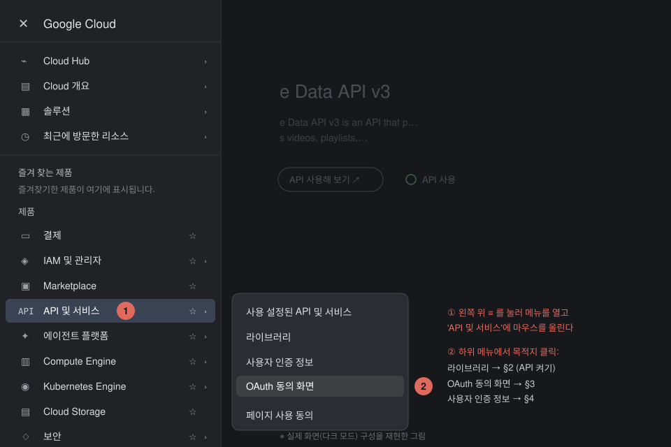

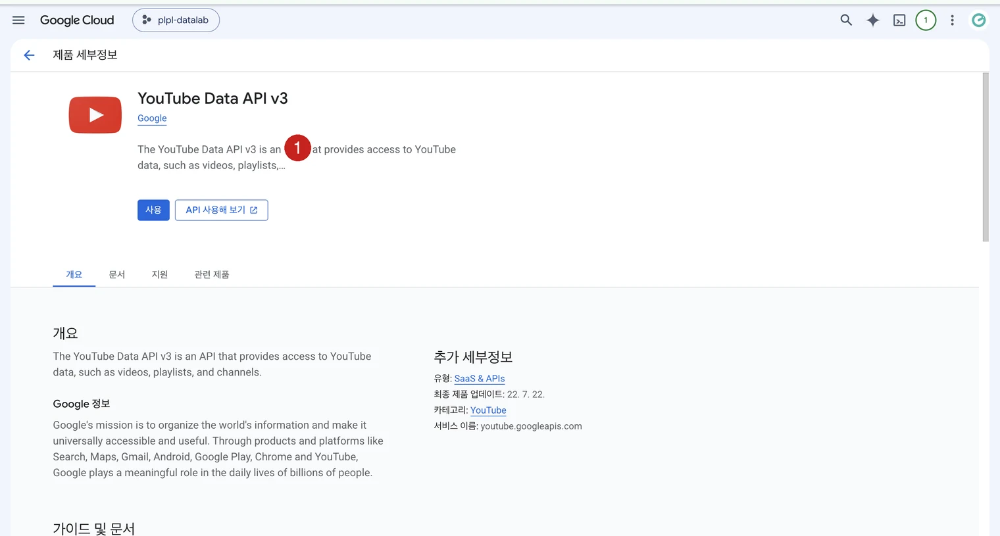

*API 상세 화면 — 라이브러리에서 "YouTube Data API v3"를 검색해 들어오면 이 화면. ① 파란
[사용] 클릭, 프로젝트마다 한 번. 이미 켠 프로젝트에서는 버튼이 [관리]로 보인다.*

1. 왼쪽 햄버거 메뉴 **≡ → API 및 서비스 → 라이브러리** 로 간다.
   (또는 <https://console.cloud.google.com/apis/library>)
2. **① 검색창에 `YouTube Data API v3`** 를 입력하고 결과를 클릭한다.
   - 비슷한 이름 주의: *YouTube Analytics API*(통계), *YouTube Reporting API*(리포트)는
     업로드와 무관하다. **Data API v3** 가 업로드 API 다.
3. 상세 페이지에서 **② 파란 [사용] 버튼**을 클릭한다. 프로젝트마다 한 번이면 된다.
4. 확인: **API 및 서비스 → 사용 설정된 API 및 서비스** 목록에 YouTube Data API v3 가
   보이면 된다. **할당량 및 시스템 한도** 탭에서 일일 10,000단위 쿼터도 보인다.

> 참고 — 콘솔에서 만들 수 있는 **API 키**는 검색·조회 같은 공개 데이터용이다.
> **업로드는 API 키로 못 한다** — 반드시 OAuth(§3~§5)여야 한다.

---

## §3 OAuth 동의 화면 구성

업로드 권한은 채널 소유 계정이 브라우저에서 "허용"을 눌러 주는 방식(OAuth)이다.
그 허용 화면에 뜰 앱 정보와, 누가 허용을 누를 수 있는지를 여기서 정한다.

들어가는 길은 **≡ → API 및 서비스 → OAuth 동의 화면** (§2 첫 그림의 메뉴).
2025년 이후 콘솔에서는 여기로 들어가면 **Google Auth Platform**(브랜딩·대상·클라이언트·
데이터 액세스 메뉴)으로 연결된다 — 이름만 바뀐 같은 화면이니 당황하지 말 것.

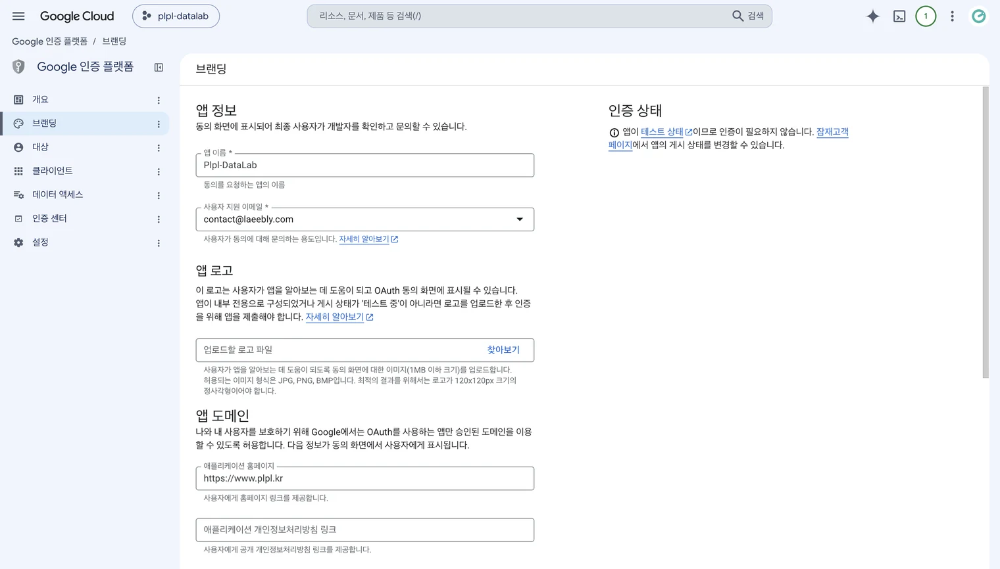

*브랜딩(앱 정보) 화면 — 앱 이름(§5 허용 화면에 뜬다)과 사용자 지원 이메일만 채우면 된다.
로고·도메인은 개인용이면 비워도 된다.*

1. **① User Type(대상)은 `외부(External)`** 를 고른다.
   - `내부(Internal)`는 Google Workspace 조직 계정 전용이다. 채널이 일반 @gmail
     계정·브랜드 계정에 붙어 있으면 External 외에 선택지가 없다.
2. **브랜딩(앱 정보)** 을 채운다:
   - **앱 이름**: `My Uploader` 처럼 알아볼 이름 — §5 의 허용 화면에 이 이름이 뜬다.
   - **사용자 지원 이메일 / 개발자 연락처**: 본인 이메일.
   - 로고·도메인은 개인용이라 비워도 된다.
3. **범위(데이터 액세스 / Scopes)** 는 여기서 미리 추가해도 되고, 발급 스크립트(부록 A)가
   요청하는 것으로 충분하다. 쓰는 범위는 둘:
   - `https://www.googleapis.com/auth/youtube.upload` — 업로드 (필수)
   - `https://www.googleapis.com/auth/youtube.readonly` — 발급 직후 채널 확인(§5-4)용
4. **② 게시 상태를 `프로덕션`으로** 바꾼다 — **[앱 게시]** 버튼.

   > ⚠ **이 단계를 건너뛰면 자동화가 일주일마다 죽는다.** 게시 상태가 `테스트`인 앱의
   > refresh token 은 **7일 만에 만료**된다(구글 정책). 업로드가 며칠 잘 돌다가
   > `invalid_grant` 로 갑자기 죽으면 십중팔구 이것이다.
   > 프로덕션으로 게시하면 "확인(검증)이 필요하다"는 안내가 뜨지만, **심사를 받지 않아도**
   > 토큰 발급·사용은 된다 — §5 에서 "확인되지 않은 앱" 경고 화면을 한 번 지나는 것과
   > (미검증 앱 기준) 사용자 100명 한도가 대가일 뿐이고, 본인 채널 몇 개에 쓰는 용도로는
   > 문제없다.

5. **③ (테스트 상태로 잠시 쓸 경우에만) 테스트 사용자**에 채널 소유 구글 계정을
   추가한다 — 등록 안 된 계정은 §5 에서 `access_denied` 가 난다. 프로덕션으로 게시했다면
   이 목록은 안 써도 된다.

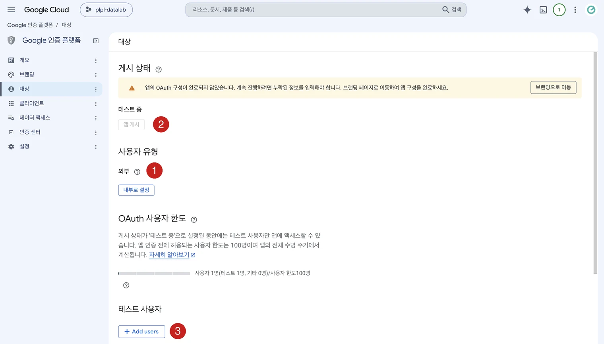

*대상(Audience) 화면 — ① User Type 은 외부(External) ② 게시 상태: 캡처처럼 '테스트 중'이면
[앱 게시]를 눌러 프로덕션으로 바꾼다(위 경고) ③ 테스트 사용자 등록은 테스트 상태로 잠시 쓸 때만.*

---

## §4 OAuth 클라이언트 ID 만들기 (데스크톱 앱)

앱(우리 스크립트)이 자신을 증명할 열쇠 한 쌍 — `client_id` / `client_secret` — 을 만든다.

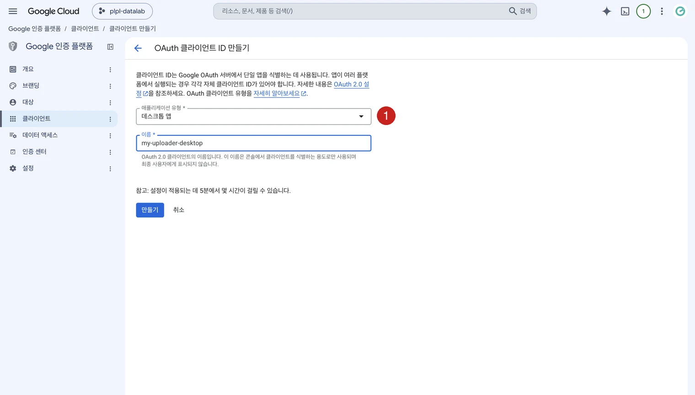

*클라이언트 생성 화면 — ① 유형은 반드시 '데스크톱 앱'(이름은 콘솔 관리용일 뿐). [만들기]를
누르면 아래 완료 모달이 뜬다.*

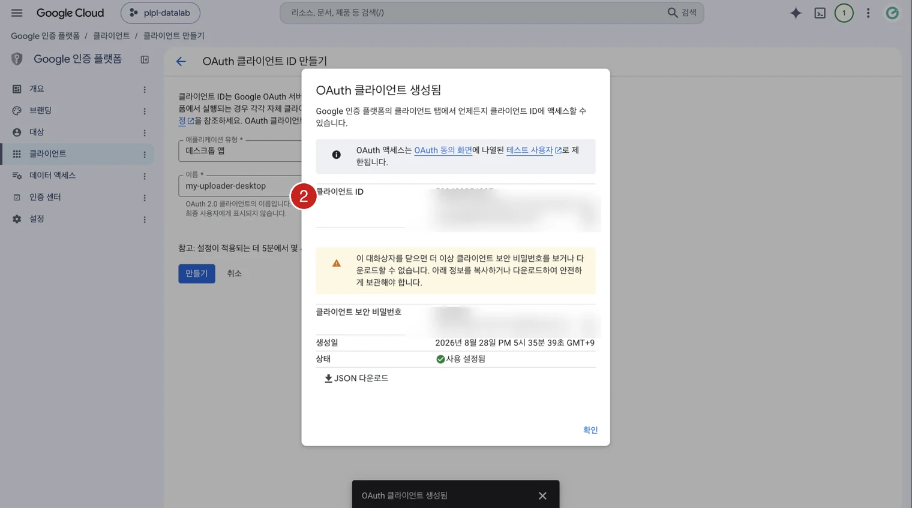

*완료 모달 — ② 클라이언트 ID 와 클라이언트 보안 비밀번호(GOCSPX-…) 두 값을 지금 복사한다.
모달을 닫으면 보안 비밀번호는 다시 볼 수 없다(분실 시 클라이언트 상세의 Add secret 로 재발급).
JSON 다운로드도 해 두되, 시크릿이므로 레포 커밋·다운로드 폴더 방치 금지. (캡처의 두 값은 흐림 처리)*

1. **≡ → API 및 서비스 → 사용자 인증 정보** (§2 첫 그림의 메뉴,
   또는 <https://console.cloud.google.com/apis/credentials>)
2. 상단 **[+ 사용자 인증 정보 만들기] → OAuth 클라이언트 ID** 를 고른다.
3. **① 애플리케이션 유형: `데스크톱 앱`** 을 고른다.
   - 웹 앱이 아니라 데스크톱 앱이다 — 발급 스크립트(부록 A)가 로컬 루프백
     (`http://127.0.0.1:포트`)으로 허용 코드를 받는 방식이라, 데스크톱 앱 유형이어야
     리디렉션 URI 등록 없이 동작한다. (웹 유형으로 만들면 §5 에서
     `redirect_uri_mismatch` 가 난다.)
4. 이름을 넣고(`my-uploader-desktop` 등 — 콘솔 관리용 이름일 뿐이다) **[만들기]**.
5. **② 생성 완료 모달의 두 값을 지금 복사**한다:
   - 클라이언트 ID — `숫자-문자열.apps.googleusercontent.com`
   - 클라이언트 보안 비밀번호 — `GOCSPX-…`
   - **[JSON 다운로드]** 로 받아 두면 재확인이 편하다. 단, 이 JSON 도 시크릿이다 —
     레포 커밋 금지, 다운로드 폴더에 방치 금지.

> 하나의 클라이언트로 **여러 채널의 토큰을 발급해도 된다** — 클라이언트는 "앱",
> 토큰은 "채널 허용"이다. 단 **발급에 쓴 클라이언트와 실행 환경의 클라이언트가 같아야**
> 한다 — 짝이 어긋나면 `invalid_grant`(§9).

---

## §5 채널 refresh token 발급

핵심 개념: **access token** 은 1시간짜리 일회용이고, **refresh token** 은 "이 채널이 이 앱에
준 영구 허용장"이다. 스크립트는 매 업로드마다 refresh token 으로 access token 을 새로 만들어
쓴다. 그래서 저장해 두는 것은 refresh token 이다.

### 5-1 발급 스크립트 실행

**부록 A** 의 `get_token.py` 를 저장해 실행한다:

```bash
python3 get_token.py        # client_id/secret 을 물어보고 브라우저를 연다
```

⚠ 브라우저가 열려야 하므로 **화면이 있는 컴퓨터에서** 실행한다. 서버에서 돌릴 자동화라도
발급은 로컬에서 하고 값만 서버로 옮기면 된다 — 토큰은 컴퓨터에 묶이지 않는다.

### 5-2 계정 선택 — 가장 중요한 클릭

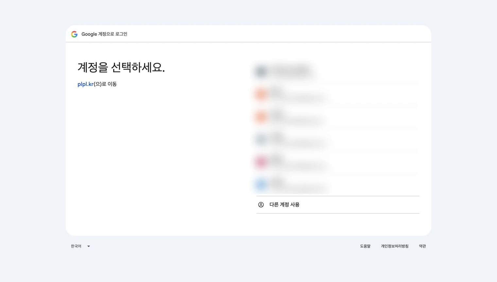

*1단계 — 구글 계정 선택. 채널을 소유한 구글 계정을 고른다. 왼쪽의 '…(으)로 이동' 자리에는
앱 이름 또는 앱 도메인이 뜬다. (캡처의 계정 목록은 흐림 처리)*

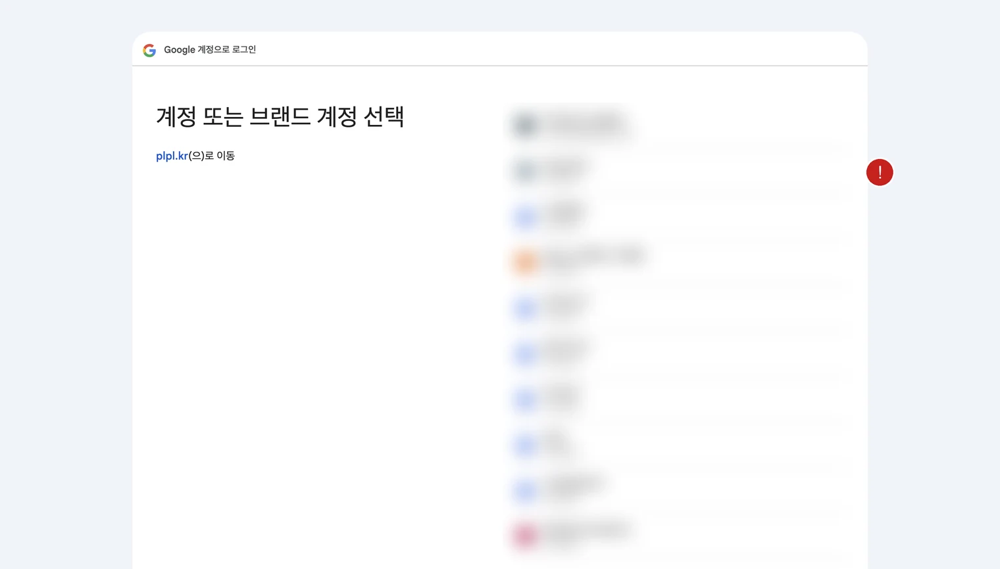

*2단계 — 채널(브랜드 계정) 선택. 고른 계정이 채널을 소유하면 이 화면이 이어진다.
(캡처의 채널 목록은 흐림 처리)*

토큰은 여기(2단계)서 고르는 줄에 **영구 바인딩**된다.

- 개인 계정 줄이 아니라, **업로드할 채널 줄**을 클릭한다.
- 한 구글 계정이 채널 여러 개를 소유하면 채널 줄이 여러 개 보인다 —
  **여기서 잘못 고르는 것이 "엉뚱한 채널에 올라가는" 사고의 근원**이다. 잘못 고른 토큰은
  발급 과정 어디에도 티가 안 나고, 영상이 다른 채널에 올라가고 나서야 발견된다.
  그래서 §5-4 검증이 필수다.
- 채널이 개인 계정에 직접 붙어 있으면(브랜드 계정이 아니면) 개인 계정 줄이 곧 채널이다 —
  역시 §5-4 로 확인한다.

### 5-3 경고 지나 허용까지

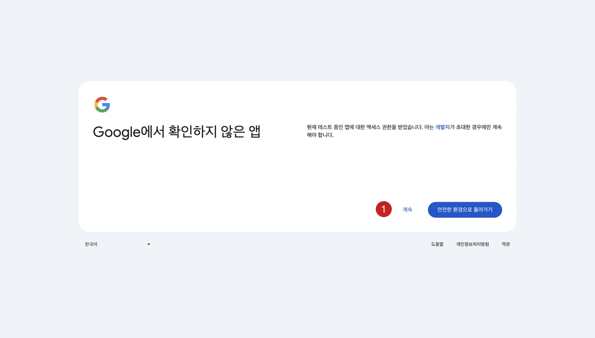

*"확인하지 않은 앱" 경고 — §3 에서 만든 본인용 앱이라 뜨는 정상 화면. ① [계속] 클릭.
캡처처럼 앱이 '테스트' 상태면 [계속] 버튼 형태이고, 프로덕션으로 게시한 미검증 앱이면
'고급 ▾ → …(으)로 이동'을 펼치는 형태로 뜬다. 모르는 타사 앱이 이 화면을 띄우면 당연히
진행 금지.*

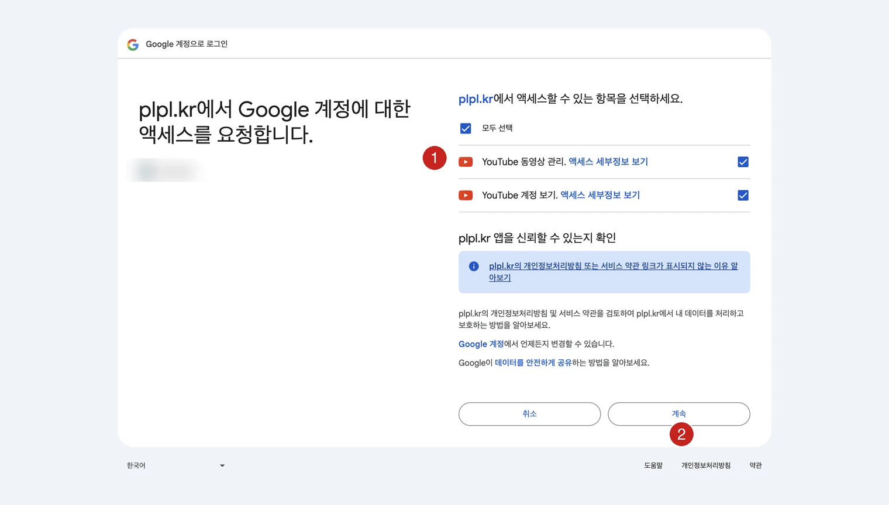

*권한 허용 — ① YouTube 동영상 관리(업로드)·YouTube 계정 보기 체크박스를 모두 체크
② [계속]. 허용을 마치면 터미널의 발급 스크립트가 refresh token 을 출력한다.
(캡처의 채널명은 흐림 처리)*

### 5-4 토큰 확인과 채널 검증

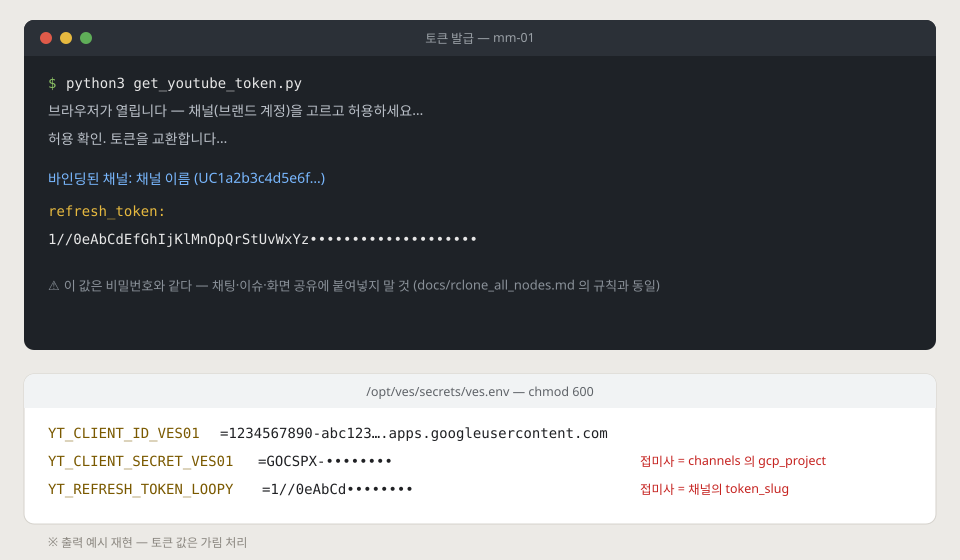

허용을 마치면 터미널의 스크립트가 `refresh_token`(형태: `1//0e…`)을 출력한다.
부록 A 스크립트는 이어서 **이 토큰이 실제로 어느 채널에 바인딩됐는지**
(`channels.list?mine=true`) 채널명을 찍는다 — **여기 찍힌 채널명이 올리려는 채널과 같은지
눈으로 확인**하는 것이 §5-2 실수를 잡는 유일한 그물이다.

- 토큰은 비밀번호다 — 채팅·문서·레포·화면 공유에 붙여넣지 말 것.
- 같은 계정으로 재발급하면 이전 토큰은 무효가 될 수 있다 — 발급 즉시 §6 보관까지
  이어서 한다.

---

## §6 자격증명 보관 (.env)

스크립트와 같은 폴더에 `.env` 파일을 만들고 세 값을 넣는다:

```bash
# .env — 업로더 폴더에. chmod 600 권장, 절대 커밋 금지
YT_CLIENT_ID=1234567890-abc….apps.googleusercontent.com
YT_CLIENT_SECRET=GOCSPX-…
YT_REFRESH_TOKEN=1//0e…
```

- git 레포 안이라면 `.gitignore` 에 `.env` 를 **먼저** 넣고 나서 파일을 만든다.
  한 번이라도 커밋되면 히스토리에 남는다 — 그때는 토큰 폐기·재발급이 정답이다.
- 채널이 여러 개면 채널별로 접미사를 붙인다(예: `YT_REFRESH_TOKEN_CHANNEL_A`) —
  클라이언트 한 쌍 + 채널별 토큰 N개 구조.
- 서버(NAS·리눅스 박스 등)로 옮길 때는 파일 권한을 600 으로:
  `chmod 600 .env`

**배치 검증** — 첫 업로드를 기다리지 말고 지금 확인한다:

```bash
python3 - <<'EOF'
import json, urllib.parse, urllib.request
def load_env(path=".env"):
    d = {}
    for line in open(path, encoding="utf-8"):
        line = line.strip()
        if line and not line.startswith("#") and "=" in line:
            k, v = line.split("=", 1); d[k.strip()] = v.strip()
    return d
e = load_env()
body = urllib.parse.urlencode({
    "client_id": e["YT_CLIENT_ID"], "client_secret": e["YT_CLIENT_SECRET"],
    "refresh_token": e["YT_REFRESH_TOKEN"], "grant_type": "refresh_token"}).encode()
tok = json.load(urllib.request.urlopen(urllib.request.Request(
    "https://oauth2.googleapis.com/token", data=body), timeout=20))
req = urllib.request.Request(
    "https://www.googleapis.com/youtube/v3/channels?part=snippet&mine=true",
    headers={"Authorization": "Bearer " + tok["access_token"]})
items = json.load(urllib.request.urlopen(req, timeout=20)).get("items") or []
print("OK —", items[0]["snippet"]["title"] if items else "채널 조회 실패(권한 범위 확인)")
EOF
```

- `OK — <채널명>` 이 **올리려는 채널명**이면 끝.
- `invalid_grant` → 그 클라이언트로 발급된 토큰이 아니거나 만료됐다(§9).
- 다른 채널명이 찍히면 → §5-2 를 잘못 골랐다. 재발급.

---

## §7 업로드 스크립트와 자동화

### 7-1 업로드 스크립트 (`yt_upload.py`)

표준 라이브러리만 쓴다. resumable 업로드(세션 만들기 → 바이트 전송)라 큰 파일도 안전하다.

```python
#!/usr/bin/env python3
"""유튜브 업로드 — .env 의 자격증명으로 resumable 업로드 + 예약 공개.

사용:
  python3 yt_upload.py --file video.mp4 --title "제목" --privacy private
  python3 yt_upload.py --file video.mp4 --title "제목" \
      --publish-at 2026-08-30T10:00:00Z          # UTC — KST 19:00 은 10:00Z
"""
import argparse, json, pathlib, urllib.error, urllib.parse, urllib.request

TOKEN_URL = "https://oauth2.googleapis.com/token"
UPLOAD_URL = ("https://www.googleapis.com/upload/youtube/v3/videos"
              "?part=snippet,status&uploadType=resumable")


def load_env(path=".env"):
    d = {}
    for line in open(path, encoding="utf-8"):
        line = line.strip()
        if line and not line.startswith("#") and "=" in line:
            k, v = line.split("=", 1)
            d[k.strip()] = v.strip()
    return d


def access_token(env):
    body = urllib.parse.urlencode({
        "client_id": env["YT_CLIENT_ID"], "client_secret": env["YT_CLIENT_SECRET"],
        "refresh_token": env["YT_REFRESH_TOKEN"],
        "grant_type": "refresh_token"}).encode()
    with urllib.request.urlopen(urllib.request.Request(TOKEN_URL, data=body),
                                timeout=30) as r:
        tok = json.loads(r.read().decode())
    if "access_token" not in tok:
        raise SystemExit(f"토큰 갱신 실패: {tok} — 재발급 필요(§5)")
    return tok["access_token"]


def upload(video_path, body, token):
    """resumable: ① 업로드 세션 만들기 ② 세션 URL 로 바이트 PUT → video id."""
    video_path = pathlib.Path(video_path)
    size = video_path.stat().st_size
    init = urllib.request.Request(
        UPLOAD_URL, data=json.dumps(body).encode(), method="POST",
        headers={"Authorization": f"Bearer {token}",
                 "Content-Type": "application/json; charset=UTF-8",
                 "X-Upload-Content-Type": "video/mp4",
                 "X-Upload-Content-Length": str(size)})
    with urllib.request.urlopen(init, timeout=60) as r:
        session_url = r.headers.get("Location")
    if not session_url:
        raise SystemExit("업로드 세션 URL 없음 — 응답 확인")
    put = urllib.request.Request(
        session_url, data=video_path.read_bytes(), method="PUT",
        headers={"Authorization": f"Bearer {token}", "Content-Type": "video/mp4"})
    with urllib.request.urlopen(put, timeout=1800) as r:
        return json.loads(r.read().decode())["id"]


def main():
    ap = argparse.ArgumentParser()
    ap.add_argument("--file", required=True)
    ap.add_argument("--title", required=True, help="최대 100자")
    ap.add_argument("--description", default="", help="최대 5,000자")
    ap.add_argument("--tags", nargs="*", default=[])
    ap.add_argument("--category", default="22",
                    help="22 인물/블로그 · 24 엔터 · 10 음악 · 20 게임")
    ap.add_argument("--privacy", default="private",
                    choices=["private", "unlisted", "public"])
    ap.add_argument("--publish-at",
                    help="예약 공개 시각, RFC3339 UTC (예: 2026-08-30T10:00:00Z). "
                         "지정하면 privacy 는 private 로 강제된다(유튜브 규약)")
    ap.add_argument("--made-for-kids", action="store_true")
    a = ap.parse_args()

    snippet = {"title": a.title[:100], "description": a.description[:5000],
               "tags": a.tags[:30], "categoryId": a.category}
    status = {"privacyStatus": a.privacy,
              "selfDeclaredMadeForKids": a.made_for_kids}
    if a.publish_at:                       # 예약 = private + publishAt 조합
        status["privacyStatus"] = "private"
        status["publishAt"] = a.publish_at

    env = load_env()
    token = access_token(env)              # 업로드 전에 자격증명부터 — 실패는 빨리
    try:
        vid = upload(a.file, {"snippet": snippet, "status": status}, token)
    except urllib.error.HTTPError as e:
        raise SystemExit(f"업로드 실패 HTTP {e.code}: {e.read().decode()[:400]}")
    when = f", 예약 {status['publishAt']}" if status.get("publishAt") else ""
    print(f"완료 https://youtu.be/{vid} ({status['privacyStatus']}{when})")


if __name__ == "__main__":
    main()
```

써 보기:

```bash
# 비공개로 올려서 먼저 확인
python3 yt_upload.py --file test.mp4 --title "업로드 테스트" --privacy private

# 내일 저녁 7시(KST) 예약 공개 — KST 19:00 = UTC 10:00
python3 yt_upload.py --file ep01.mp4 --title "1화" \
    --description "설명" --tags 여행 브이로그 --publish-at 2026-08-30T10:00:00Z
```

예약 공개 규칙(유튜브 규약):

- `publishAt` 은 **RFC3339 UTC** (`YYYY-MM-DDThh:mm:ssZ`), **미래 시각**이어야 한다.
  KST 는 UTC+9 — 저녁 7시 공개면 `10:00:00Z`.
- 예약은 `private` + `publishAt` 조합이다 — 시각이 되면 유튜브가 알아서 공개한다.
  스크립트가 이 조합을 강제하므로 시각만 넘기면 된다.

### 7-2 매일 자동 실행 (cron)

"완성본을 `outbox/` 폴더에 넣어 두면, 매일 저녁 한 편씩 올라가고 다음 날 19시에 공개"
패턴이다. 영상 옆에 같은 이름의 `.json` 으로 제목·설명을 둔다:

```
outbox/
  ep01.mp4
  ep01.json      # {"title": "1화", "description": "…", "tags": ["여행"]}
done/            # 업로드 완료분이 옮겨진다 — 중복 업로드 방지
```

`auto_upload.py` — outbox 의 가장 오래된 한 편을 내일 19:00(KST) 예약으로 올리고 옮긴다:

```python
#!/usr/bin/env python3
"""outbox/ 의 다음 영상 1편을 예약 업로드하고 done/ 으로 옮긴다. cron 용."""
import datetime as dt, json, pathlib, shutil
import yt_upload                                     # 7-1 스크립트를 모듈로 씀

OUTBOX, DONE = pathlib.Path("outbox"), pathlib.Path("done")
PUBLISH_HHMM_KST = (19, 0)                           # 공개 시각 (KST)

videos = sorted(OUTBOX.glob("*.mp4"))
if not videos:
    raise SystemExit("outbox 비어 있음 — 오늘은 올릴 것 없음")
video = videos[0]
meta = json.loads(video.with_suffix(".json").read_text(encoding="utf-8"))

kst = dt.timezone(dt.timedelta(hours=9))
slot = (dt.datetime.now(kst) + dt.timedelta(days=1)).replace(
    hour=PUBLISH_HHMM_KST[0], minute=PUBLISH_HHMM_KST[1], second=0, microsecond=0)
publish_at = slot.astimezone(dt.timezone.utc).strftime("%Y-%m-%dT%H:%M:%SZ")

env = yt_upload.load_env()
token = yt_upload.access_token(env)
body = {"snippet": {"title": meta["title"][:100],
                    "description": meta.get("description", "")[:5000],
                    "tags": meta.get("tags", [])[:30],
                    "categoryId": meta.get("category", "22")},
        "status": {"privacyStatus": "private", "publishAt": publish_at,
                   "selfDeclaredMadeForKids": False}}
vid = yt_upload.upload(video, body, token)
print(f"{video.name} → https://youtu.be/{vid} (예약 {publish_at})")

DONE.mkdir(exist_ok=True)                            # 성공했을 때만 옮긴다
shutil.move(video, DONE / video.name)
shutil.move(video.with_suffix(".json"), DONE / video.with_suffix(".json").name)
```

cron 등록 (`crontab -e`) — 매일 18:50 실행, 로그 남기기:

```cron
50 18 * * * cd /home/me/uploader && /usr/bin/python3 auto_upload.py >> upload.log 2>&1
```

- 맥이라면 cron 대신 `launchd`, 윈도우라면 작업 스케줄러로 같은 명령을 걸면 된다.
- 하루 물량이 많아도 **프로젝트당 약 6편**(부록 B)이 상한임을 기억할 것.

---

## §8 결과 확인 (YouTube Studio)

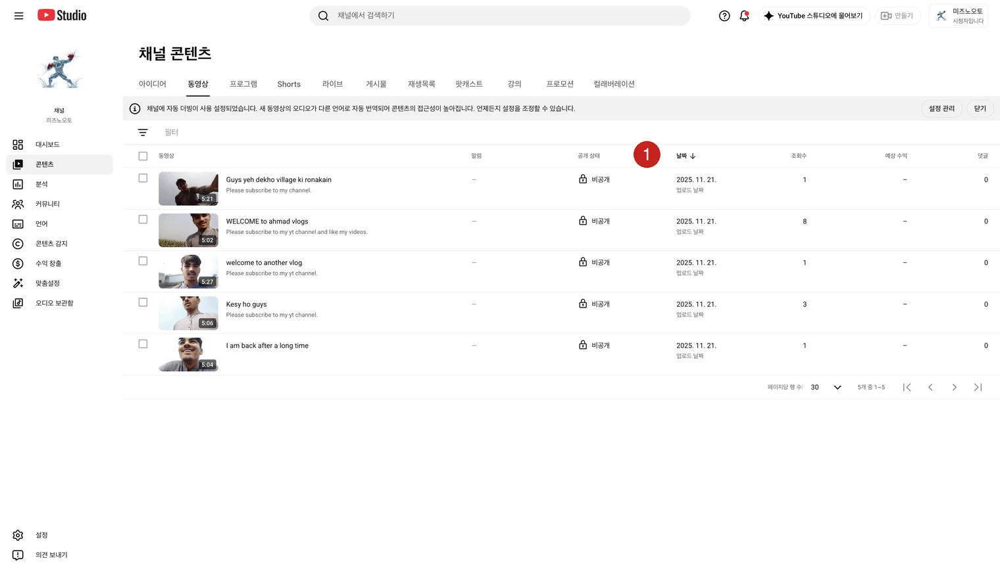

*studio.youtube.com → 콘텐츠 — ① 공개 상태 열: private 로만 올린 영상은 캡처처럼 "비공개",
예약 건은 "예약됨"+공개 예정 시각으로 보인다.*

<https://studio.youtube.com> → **콘텐츠** 에서:

- 예약 건은 **"예약됨"** + 공개 예정 시각으로 보인다. 시각이 되면 유튜브가 알아서 공개한다.
- 스크립트가 출력한 `youtu.be/<id>` 와 목록이 일치하면 업로드 검증 끝.
- 예약 시각·문구는 Studio 에서 바꿔도 된다. 단 Studio 에서 **삭제**한 영상을 다시 올리려면
  `done/` 에서 꺼내 와야 한다 — 스크립트는 옮겨진 파일을 다시 보지 않는다.
- 첫 업로드는 반드시 **`--privacy private` 로 시험**하고, 제목·설명·화질을 Studio 에서
  확인한 뒤에 자동화를 켜는 것을 권한다.

---

## §9 문제 해결

에러 문구는 스크립트 출력(HTTP 응답 본문)에 그대로 찍힌다.

| 증상 | 원인 | 조치 |
|---|---|---|
| `invalid_grant` (즉시) | 토큰이 **그 클라이언트로 발급된 것이 아님** · 토큰 폐기됨(비밀번호 변경, [보안 설정](https://myaccount.google.com/permissions)에서 앱 액세스 삭제) | `.env` 의 클라이언트가 발급 때 쓴 것인지 확인, 아니면 §5 재발급 |
| `invalid_grant` (7일 뒤 갑자기) | §3 게시 상태가 `테스트` — refresh token 7일 만료 | **앱을 프로덕션으로 게시**하고 토큰 재발급 |
| `unauthorized_client` | client_id/secret 쌍이 틀림·오타 | §6 검증 스니펫으로 쌍부터 확인 |
| `redirect_uri_mismatch` (발급 중) | §4 에서 데스크톱 앱이 아닌 **웹 앱** 유형으로 만듦 | 데스크톱 앱 유형으로 클라이언트 재생성 |
| `access_denied` (발급 중) | §3 테스트 상태인데 테스트 사용자 미등록 | 계정을 테스트 사용자에 추가하거나 프로덕션 게시 |
| 응답에 `refresh_token` 이 없음 | 이미 허용한 적 있는 계정 + `prompt=consent` 누락 | 부록 A 스크립트처럼 `access_type=offline&prompt=consent` 로 재시도 |
| `accessNotConfigured` / 403 | §2 를 건너뜀 — API 미사용 상태 | 해당 프로젝트에서 YouTube Data API v3 사용 설정 |
| `quotaExceeded` | 프로젝트 일일 쿼터(10,000단위) 소진 — 업로드 1건 1,600단위 | 자정(태평양시) 리셋 대기. 상습이면 프로젝트 분리 또는 쿼터 상향 신청 |
| `uploadLimitExceeded` | **채널** 단위 업로드 제한 (쿼터와 무관 — 신규·미인증 채널에 흔함) | 24시간 대기. [채널 전화번호 인증](https://www.youtube.com/verify)으로 한도 상향 |
| `publishAt` 관련 400 | 과거 시각이거나 RFC3339 형식이 아님 · privacy 가 private 가 아님 | 미래의 `YYYY-MM-DDThh:mm:ssZ`(UTC)로. 예약은 private 조합 |
| 업로드는 됐는데 "처리 중"이 김 | 유튜브 쪽 인코딩 대기 — 정상 | 기다리면 된다. 예약 공개는 처리 완료 후 시각에 맞춰 공개된다 |

**토큰이 죽었을 때 재발급 절차**: §5 재발급(같은 클라이언트로, 그 채널 계정 골라서) →
§5-4 채널명 확인 → `.env` 교체 → §6 검증 스니펫으로 확인. 5분 걸린다.

---

## 부록 A — 토큰 발급 스크립트 (`get_token.py`)

표준 라이브러리만 쓴다. 데스크톱 클라이언트(§4)의 루프백 방식 — 로컬 포트로 허용 코드를
받아 토큰으로 교환하고, 마지막에 **바인딩된 채널명을 확인**한다(§5-4).

```python
#!/usr/bin/env python3
"""채널 refresh token 발급 — 데스크톱 OAuth 루프백. 브라우저 있는 컴퓨터에서 실행."""
import http.server, json, secrets, urllib.parse, urllib.request, webbrowser

CLIENT_ID = input("client_id: ").strip()
CLIENT_SECRET = input("client_secret: ").strip()
PORT = 8765
REDIRECT = f"http://127.0.0.1:{PORT}"
SCOPES = ("https://www.googleapis.com/auth/youtube.upload "
          "https://www.googleapis.com/auth/youtube.readonly")

state, got = secrets.token_urlsafe(16), {}

class Catch(http.server.BaseHTTPRequestHandler):
    def do_GET(self):
        got.update({k: v[0] for k, v in
                    urllib.parse.parse_qs(urllib.parse.urlparse(self.path).query).items()})
        self.send_response(200)
        self.send_header("Content-Type", "text/html; charset=utf-8"); self.end_headers()
        self.wfile.write("발급 진행 중 — 터미널로 돌아가세요.".encode())
    def log_message(self, *a): pass

auth = "https://accounts.google.com/o/oauth2/v2/auth?" + urllib.parse.urlencode({
    "client_id": CLIENT_ID, "redirect_uri": REDIRECT, "response_type": "code",
    "scope": SCOPES, "access_type": "offline", "prompt": "consent", "state": state})
print("\n브라우저에서 **채널(브랜드 계정)** 을 고르고 허용하세요.\n안 열리면 직접 여세요:\n" + auth)
webbrowser.open(auth)
http.server.HTTPServer(("127.0.0.1", PORT), Catch).handle_request()   # 리디렉션 1회 수신

assert got.get("state") == state, "state 불일치 — 다시 실행"
assert "code" in got, f"허용 실패: {got.get('error')}"
body = urllib.parse.urlencode({
    "code": got["code"], "client_id": CLIENT_ID, "client_secret": CLIENT_SECRET,
    "redirect_uri": REDIRECT, "grant_type": "authorization_code"}).encode()
tok = json.load(urllib.request.urlopen(urllib.request.Request(
    "https://oauth2.googleapis.com/token", data=body), timeout=30))

req = urllib.request.Request(
    "https://www.googleapis.com/youtube/v3/channels?part=snippet&mine=true",
    headers={"Authorization": "Bearer " + tok["access_token"]})
items = json.load(urllib.request.urlopen(req, timeout=30)).get("items") or []
print("\n바인딩된 채널:", items[0]["snippet"]["title"] if items else "확인 실패")
print("\nrefresh_token:\n" + tok["refresh_token"])
print("\n→ .env 의 YT_REFRESH_TOKEN 에 넣으세요 (§6). 이 값은 비밀번호다.")
```

- `access_type=offline` + `prompt=consent` 가 없으면 refresh token 이 안 나온다 —
  이미 허용한 적이 있는 계정은 특히.
- "바인딩된 채널" 이 올리려는 채널과 다르면 그 토큰은 버리고 다시 실행한다(§5-2).

## 부록 B — 쿼터 계산

| 항목 | 값 |
|---|---|
| 프로젝트 일일 쿼터 (기본) | 10,000 단위, 태평양시 자정 리셋 |
| `videos.insert` (업로드 1건) | **1,600 단위** — 영상 길이·크기와 무관 |
| → 프로젝트당 하루 업로드 | **약 6편** |
| `channels.list` (검증) | 1 단위 |

- 하루 6편이 모자라면: **GCP 프로젝트를 나눠** 채널을 분산하거나, 콘솔
  (사용 설정된 API → YouTube Data API v3 → 할당량)에서 상향을 신청한다(심사가 길다).
- `uploadLimitExceeded` 는 이 쿼터와 **무관**한 채널 단위 제한이다(§9).
