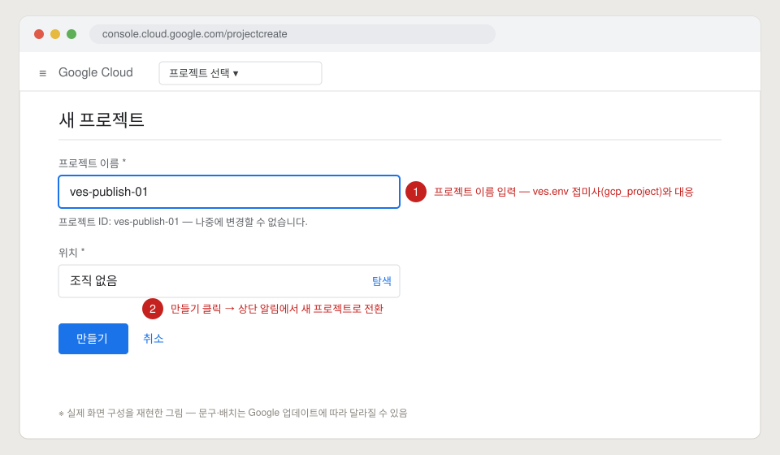
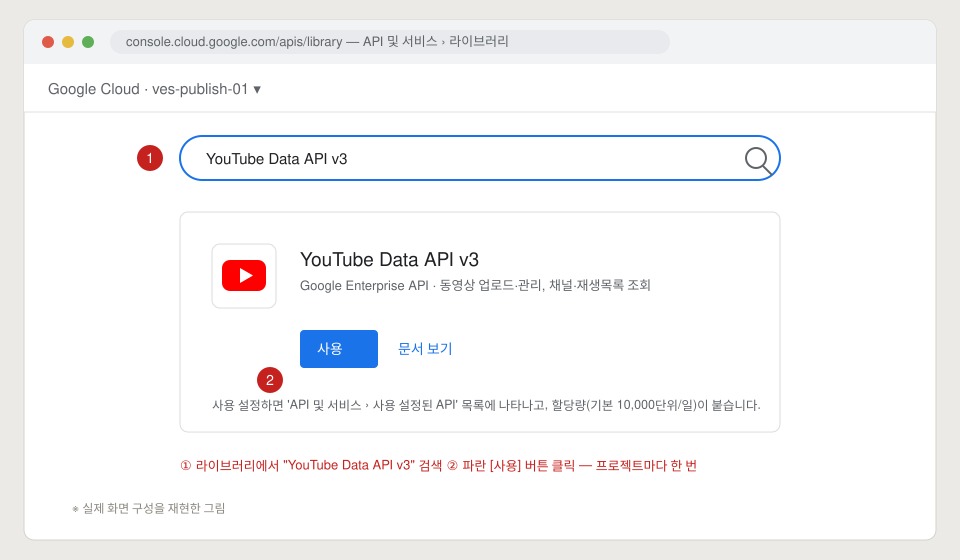
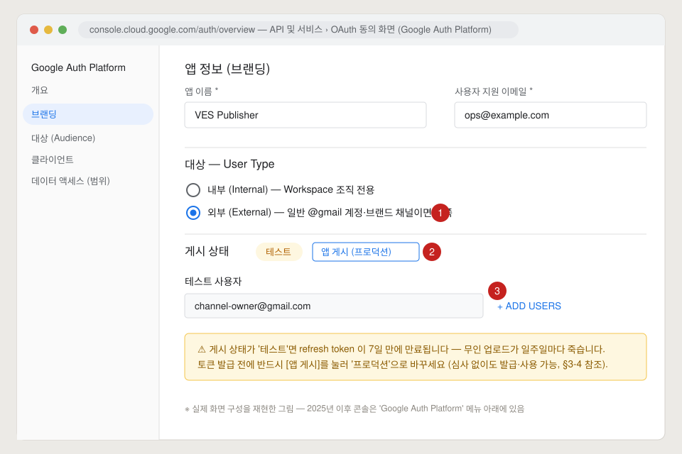
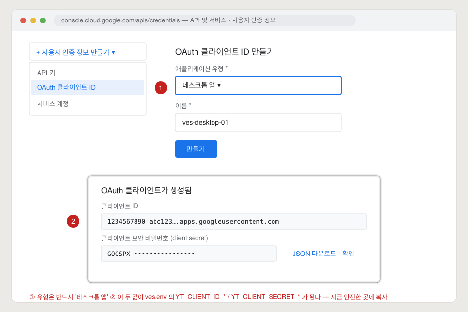
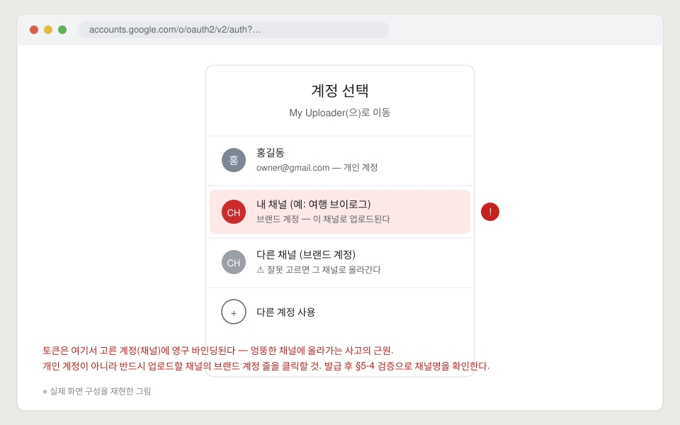
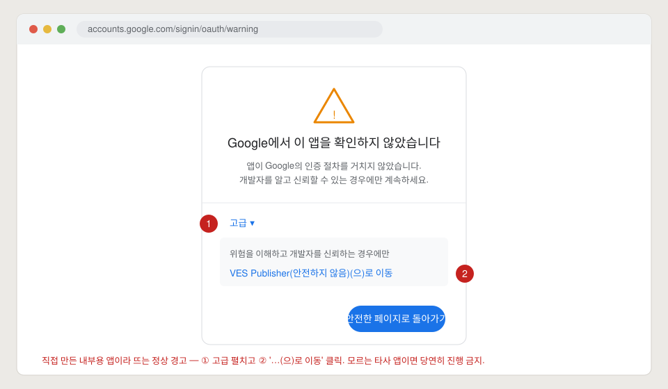
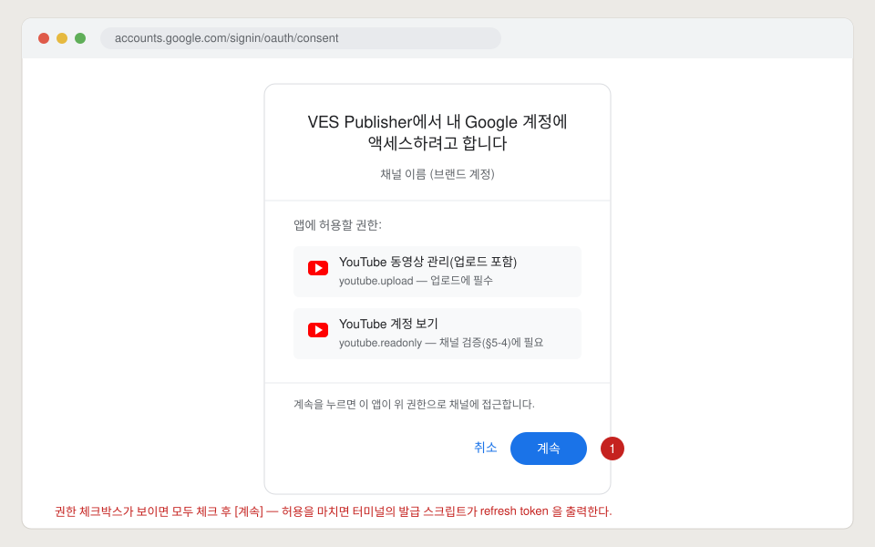
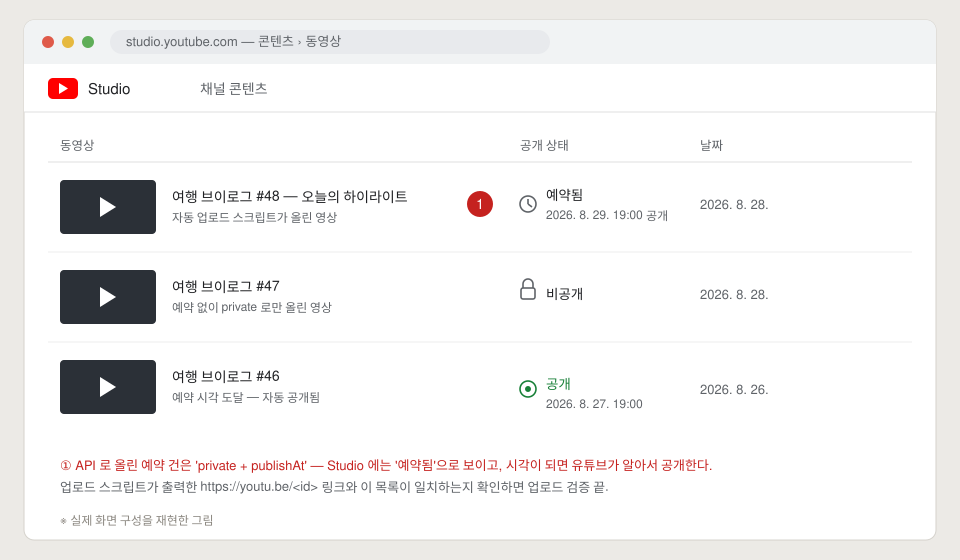

# 유튜브 자동 업로드 설명서

구글 클라우드 설정 **0원에서 시작해** → 채널 토큰 발급 → 노드 배치 → 실제 자동 발행 확인까지,
운영자가 화면을 보며 따라 할 수 있게 쓴 단계별 설명서다. 새 채널을 파이프라인에 붙일 때,
토큰이 죽어서 재발급할 때, 새 운영자가 들어왔을 때 이 문서 하나로 끝나는 것이 목표.

> **그림에 대하여** — 이 문서의 화면 그림([docs/img/yt_upload/](img/yt_upload/))은 실제 화면
> 구성을 재현한 그림이다(스크린샷 아님). 빨간 번호 ①②③이 클릭·입력 지점이고, 구글이 UI 를
> 바꾸면 문구·배치는 조금 다를 수 있지만 **흐름과 입력값은 동일**하다.

**코드 정본** — 이 문서는 설명일 뿐, 동작은 코드가 정의한다:
[`ves/adapters/publish_external.py`](../ves/adapters/publish_external.py) (외부 완성본 발행) ·
[`ves/adapters/brain.py`](../ves/adapters/brain.py) `Publish` (자체 클립 발행) ·
[`deploy/apply_loopy_token.sh`](../deploy/apply_loopy_token.sh) (토큰 일괄 교체) ·
[`deploy/secrets.env.example`](../deploy/secrets.env.example) (env 이름 규약).

---

## 목차

- [§0 큰 그림 — 자동 업로드는 이렇게 돈다](#0-큰-그림--자동-업로드는-이렇게-돈다)
- [§1 Google Cloud 프로젝트 만들기](#1-google-cloud-프로젝트-만들기)
- [§2 YouTube Data API v3 켜기](#2-youtube-data-api-v3-켜기)
- [§3 OAuth 동의 화면 구성](#3-oauth-동의-화면-구성)
- [§4 OAuth 클라이언트 ID 만들기 (데스크톱 앱)](#4-oauth-클라이언트-id-만들기-데스크톱-앱)
- [§5 채널별 refresh token 발급](#5-채널별-refresh-token-발급)
- [§6 노드에 자격증명 배치 (ves.env)](#6-노드에-자격증명-배치-vesenv)
- [§7 실제 업로드가 일어나는 순간 — 운영 흐름](#7-실제-업로드가-일어나는-순간--운영-흐름)
- [§8 문제 해결 — 실측 사고 기반](#8-문제-해결--실측-사고-기반)
- [부록 A 최소 토큰 발급 스크립트](#부록-a--최소-토큰-발급-스크립트-get_youtube_tokenpy-가-없을-때)
- [부록 B 쿼터 계산](#부록-b--쿼터-계산)
- [부록 C 관련 파일 지도](#부록-c--관련-파일-지도)

---

## §0 큰 그림 — 자동 업로드는 이렇게 돈다


"자동 업로드"라고 해서 아무거나 알아서 올라가는 것이 아니다. **사람의 검수 승인이 유일한
게이트**이고, 승인 뒤의 모든 것(파일 다운로드 → 토큰 갱신 → 업로드 → 예약 공개 → 원장 기록)이
자동이다.

1. 대시보드 검수 카드에서 사람이 제목·설명을 확인하고 **승인**한다.
2. 승인 RPC 가 `job_queue` 에 발행 잡을 넣는다 — `kind=publish`(자체 클립) 또는
   `kind=publish_external`(현지화·외부 완성본).
3. 워커(mm-0X)가 잡을 클레임하고, **파일을 만지기 전에 자격증명부터 검사**한다
   (§7-2 — 비싼 단계 뒤에 죽지 않기 위해).
4. Supabase Storage 에서 mp4 를 내려받아, refresh token 으로 access token 을 만들고,
   YouTube resumable 업로드(init→PUT)로 올린다.
5. `private + publishAt`(예약 공개)으로 올리면 예약 시각(기본 19:00 JST, 하루 1편)에
   유튜브가 알아서 공개한다.
6. 원장(`external_shorts` / clips)에 `youtube_id` 를 기록한다 — id 가 이미 있으면
   그 잡은 아무것도 하지 않는다(재업로드 금지, 멱등).

### 발행 경로는 둘이다

| | `publish` (brain) | `publish_external` |
|---|---|---|
| 대상 | 우리가 생성한 클립 (`clip_id` 필수) | 외부 완성본·현지화판 (clip 없음) |
| 안전 게이트 | judge 안전판정 (`judge_runs`) | **사람 검수 승인** (`localization_qa` 카드) |
| 실행 주체 | brain 레포 `publish_youtube.py` 를 서브프로세스로 | 워커가 직접 API 호출 |
| 코드 | `ves/adapters/brain.py` `Publish` | `ves/adapters/publish_external.py` |

### 워커가 강제하는 안전 규칙

| 규칙 | 내용 | 걸리면 |
|---|---|---|
| **R9** | public 직행 금지 — `private` / `unlisted` / 예약(`private`+`publishAt`)만 | PermanentError, 발행 안 됨 |
| **R10** | refresh token 미발급 채널은 발행 하드실패 | 어느 env 키가 비었는지 **이름으로** 알림 |
| 재업로드 금지 | 원장에 `youtube_id` 있으면 건너뜀 | `skipped: already_uploaded` |
| 한글 잔류 차단 | 일본 채널 제목·설명에 한글 토막이 남으면 차단 | 지울 토막(`#태그`)을 알려주고 중단 |
| 빈 메타 차단 | 제목·설명이 비면 발행 자체를 안 함 (0075 사고 재발 방지) | PermanentError |

### 준비물 체크리스트 (§1~§6 이 만드는 것)

- [ ] Google Cloud 프로젝트 + YouTube Data API v3 사용 설정 (§1·§2)
- [ ] OAuth 동의 화면 — External · **프로덕션 게시** (§3)
- [ ] OAuth 클라이언트(데스크톱 앱) — `client_id` / `client_secret` (§4)
- [ ] 채널마다 refresh token 1개 — **그 채널 브랜드 계정으로** 발급 (§5)
- [ ] 6대 노드 `ves.env` 에 규약 이름으로 배치 + 검증 (§6)

---

## §1 Google Cloud 프로젝트 만들기

유튜브 업로드 API 는 구글 클라우드 "프로젝트"에 속한 OAuth 클라이언트로만 부를 수 있다.
**프로젝트 = 쿼터의 단위**다(기본 10,000단위/일 ≈ 하루 6편, 부록 B). 채널이 많으면
프로젝트를 나눠야 하고, 그래서 우리 규약이 `YT_CLIENT_ID_<gcp_project>` 처럼
프로젝트별 접미사를 갖는다.



1. 채널을 소유한 구글 계정으로 <https://console.cloud.google.com> 에 로그인한다.
2. 상단 바 왼쪽의 **프로젝트 선택 ▾** 를 누르고, 뜨는 창에서 **새 프로젝트**를 누른다.
   (또는 바로 <https://console.cloud.google.com/projectcreate>)
3. **① 프로젝트 이름**을 입력한다 — 예: `ves-publish-01`.
   - 이름 아래 **프로젝트 ID** 가 자동으로 잡힌다. *나중에 못 바꾸니* 지금 확인.
   - 이 프로젝트가 담당할 채널 묶음을 알 수 있는 이름으로. 우리 함대의 접미사
     (`VES01`, `P2`, `JMLP`…)와 대응시켜 두면 env 파일에서 헤매지 않는다.
4. 위치(조직)는 개인 계정이면 **조직 없음** 그대로 둔다.
5. **② [만들기]** 클릭 → 오른쪽 위 알림에서 생성 완료를 확인하고, **프로젝트 선택 ▾** 로
   방금 만든 프로젝트로 **전환**한다. (이후 §2~§4 는 전부 이 프로젝트 안에서 한다 —
   다른 프로젝트가 선택된 채로 진행하는 것이 초보 실수 1위.)

---

## §2 YouTube Data API v3 켜기

프로젝트를 만들어도 API 는 꺼져 있다. 켜지 않고 호출하면 `accessNotConfigured` 403 이 난다.



1. 왼쪽 햄버거 메뉴 **≡ → API 및 서비스 → 라이브러리** 로 간다.
   (또는 <https://console.cloud.google.com/apis/library>)
2. **① 검색창에 `YouTube Data API v3`** 를 입력하고 결과를 클릭한다.
   - 비슷한 이름 주의: *YouTube Analytics API*(통계용), *YouTube Reporting API*(리포트용)는
     업로드와 무관하다. **Data API v3** 가 업로드 API 다.
3. 상세 페이지에서 **② 파란 [사용] 버튼**을 클릭한다. 프로젝트마다 한 번이면 된다.
4. 확인: **API 및 서비스 → 사용 설정된 API 및 서비스** 목록에 YouTube Data API v3 가
   보이면 된다. 여기서 **할당량** 탭을 열면 일일 10,000단위 쿼터도 보인다.

> 참고 — `ves.env` 의 `YOUTUBE_API_KEY`(조회 전용, perf_sync·channels_sync 용)도 같은 API 를
> 쓰지만 **API 키**라서 업로드는 못 한다. 업로드는 반드시 OAuth(§3~§5)다.

---

## §3 OAuth 동의 화면 구성

업로드 권한은 사용자(채널 소유 계정)가 브라우저에서 "허용"을 눌러 주는 방식(OAuth)이다.
그 허용 화면에 뜰 앱 정보와, 누가 허용을 누를 수 있는지를 여기서 정한다.

2025년 이후 콘솔에서는 **≡ → API 및 서비스 → OAuth 동의 화면** 으로 들어가면
**Google Auth Platform**(브랜딩·대상·클라이언트·데이터 액세스 메뉴)으로 연결된다 —
같은 것이니 당황하지 말 것.



1. **① User Type(대상)은 `외부(External)`** 를 고른다.
   - `내부(Internal)`는 Google Workspace 조직 계정 전용이다. 채널이 일반 @gmail
     계정·브랜드 계정에 붙어 있으면 External 외에 선택지가 없다.
2. **브랜딩(앱 정보)** 을 채운다:
   - **앱 이름**: `VES Publisher` 처럼 알아볼 이름 — §5 의 허용 화면에 이 이름이 뜬다.
   - **사용자 지원 이메일 / 개발자 연락처**: 운영 계정 이메일.
   - 나머지(로고·도메인)는 내부용이라 비워도 된다.
3. **범위(데이터 액세스 / Scopes)** 는 여기서 미리 추가해도 되고, 발급 스크립트가
   요청하는 것으로 충분하다. 우리가 쓰는 범위는 둘:
   - `https://www.googleapis.com/auth/youtube.upload` — 업로드 (필수)
   - `https://www.googleapis.com/auth/youtube.readonly` — 채널 검증(§5-4, §6-3)용
4. **② 게시 상태를 `프로덕션`으로** 바꾼다 — **[앱 게시]** 버튼.

   > ⚠ **이 단계를 건너뛰면 무인 운행이 일주일마다 죽는다.** 게시 상태가 `테스트`인 앱의
   > refresh token 은 **7일 만에 만료**된다(구글 정책). 발행이 며칠 잘 돌다가
   > `invalid_grant` 로 일제히 죽으면 십중팔구 이것이다.
   > 프로덕션으로 게시하면 "확인(검증) 필요" 안내가 뜨지만, **심사를 받지 않아도**
   > 토큰 발급·사용은 된다 — §5 에서 "확인되지 않은 앱" 경고 화면을 한 번 지나는 것과
   > (미검증 앱 기준) 사용자 100명 한도가 대가일 뿐이고, 우리는 채널 소유 계정 몇 개만
   > 쓰므로 문제없다.

5. **③ (테스트 상태로 잠시 쓸 경우에만) 테스트 사용자**에 채널 소유 구글 계정을
   추가한다 — 등록 안 된 계정은 §5 에서 `access_denied` 가 난다. 프로덕션으로 게시했다면
   이 목록은 안 써도 된다.

---

## §4 OAuth 클라이언트 ID 만들기 (데스크톱 앱)

앱(우리 스크립트)이 자신을 증명할 열쇠 한 쌍 — `client_id` / `client_secret` — 을 만든다.
이것이 `ves.env` 의 `YT_CLIENT_ID_*` / `YT_CLIENT_SECRET_*` 가 된다.



1. **≡ → API 및 서비스 → 사용자 인증 정보** (<https://console.cloud.google.com/apis/credentials>)
2. 상단 **[+ 사용자 인증 정보 만들기] → OAuth 클라이언트 ID** 를 고른다.
3. **① 애플리케이션 유형: `데스크톱 앱`** 을 고른다.
   - 웹 앱이 아니라 데스크톱 앱이다 — 발급 스크립트(§5, 부록 A)가 로컬 루프백
     (`http://127.0.0.1:포트`)으로 코드를 받는 방식이라, 데스크톱 앱 유형이어야
     리디렉션 URI 등록 없이 동작한다.
4. 이름을 넣고(`ves-desktop-01` 등 — 콘솔 관리용 이름일 뿐이다) **[만들기]**.
5. **② 생성 완료 모달의 두 값을 지금 복사**한다:
   - 클라이언트 ID — `숫자-문자열.apps.googleusercontent.com`
   - 클라이언트 보안 비밀번호 — `GOCSPX-…`
   - **[JSON 다운로드]** 로 받아 두면 재확인이 편하다. 단, 이 JSON 은 시크릿이다 —
     레포에 커밋 금지, 다운로드 폴더에 방치 금지.

> 하나의 클라이언트로 **여러 채널의 토큰을 발급해도 된다**(클라이언트는 "앱",
> 토큰은 "채널 허용"이다). 우리 함대도 프로젝트당 클라이언트 1쌍 + 채널별 토큰 N개 구조다.
> 단 **발급에 쓴 클라이언트와 노드의 클라이언트가 같아야** 한다 — 다르면 `invalid_grant`
> (§8). 토큰마다 어느 프로젝트 클라이언트로 발급했는지 기록해 둘 것.

---

## §5 채널별 refresh token 발급

핵심 개념: **access token** 은 1시간짜리 일회용이고, **refresh token** 은 "이 채널이 이 앱에
준 영구 허용장"이다. 워커는 매 발행마다 refresh token 으로 access token 을 새로 만들어
쓴다(`publish_external.py` `_access_token`). 그래서 노드에 넣는 것은 refresh token 이다.

### 5-1 발급 스크립트 실행

brain 레포의 `get_youtube_token.py` 를 쓴다 (MACHINE_SETUP §0-7). 없으면 **부록 A** 의
최소 스크립트를 아무 데나 저장해 실행하면 된다. 둘 다 하는 일은 같다:

```bash
python3 get_youtube_token.py        # client_id/secret 을 물어보고 브라우저를 연다
```

⚠ 브라우저가 열려야 하므로 **화면이 있는 머신에서** 실행한다(맥미니에 화면 공유로 들어가서
해도 되고, 로컬 노트북에서 발급해 값만 옮겨도 된다 — 토큰은 머신에 묶이지 않는다).

### 5-2 계정 선택 — 가장 중요한 클릭



브라우저에 구글 **계정 선택** 화면이 뜬다. 여기서 고르는 계정에 토큰이 **영구 바인딩**된다.

- 개인 계정(이메일이 보이는 줄)이 아니라, **업로드할 채널의 브랜드 계정 줄**을 클릭한다.
- 한 구글 계정이 채널 여러 개를 소유하면 브랜드 계정 줄이 여러 개 보인다 —
  **여기서 잘못 고르는 것이 오채널 업로드 사고의 근원**이다. 잘못 고른 토큰은 발급 화면
  어디에도 티가 안 나고, 새벽에 엉뚱한 채널에 영상이 올라가고 나서야 발견된다.
  그래서 §5-4 검증이 필수다.

### 5-3 경고 지나 허용까지



"**Google에서 이 앱을 확인하지 않았습니다**" 경고가 뜨면 — 우리가 §3 에서 심사 없이 게시한
내부용 앱이라 뜨는 **정상 화면**이다. **① [고급]** 을 펼치고 **② [VES Publisher(안전하지
않음)(으)로 이동]** 을 클릭한다. (당연히, 모르는 타사 앱이 이 화면을 띄우면 진행하면 안 된다.)



권한 화면에서 **YouTube 동영상 관리(업로드)** 와 **YouTube 계정 보기** 를 (체크박스가 있으면
모두 체크하고) **[계속/허용]** 한다.

### 5-4 토큰 확인과 채널 검증


허용을 마치면 터미널의 스크립트가 `refresh_token`(형태: `1//0e…`)을 출력한다.
부록 A 스크립트는 이어서 **이 토큰이 실제로 어느 채널에 바인딩됐는지**
(`channels.list?mine=true`) 채널명을 찍는다 — **여기 찍힌 채널명이 올리려는 채널과 같은지
눈으로 확인**하는 것이 §5-2 실수를 잡는 유일한 그물이다.
(`deploy/apply_loopy_token.sh` 의 `verify_token` 이 하는 검증과 같다.)

- 토큰은 비밀번호다 — 채팅·이슈·화면 공유에 붙여넣지 말 것
  ([docs/rclone_all_nodes.md](rclone_all_nodes.md) 의 규칙과 동일).
- 재발급하면 이전 토큰은 (같은 클라이언트+계정 조합에서) 무효가 될 수 있다 —
  발급 즉시 §6 배치까지 이어서 한다.

---

## §6 노드에 자격증명 배치 (ves.env)

### 6-1 이름 규약 — 접미사가 전부다

워커는 잡의 `gcp_project` 와 채널 `token_slug` 로 env 키 이름을 **조립**해서 찾는다
(`publish_external.credential_keys`). 이름이 규약과 다르면 값이 있어도 못 찾는다.

| 키 | 접미사의 뜻 | 예 |
|---|---|---|
| `YT_CLIENT_ID_<gcp_project>` | §1 프로젝트(= §4 클라이언트) 구분자 | `YT_CLIENT_ID_VES01` |
| `YT_CLIENT_SECRET_<gcp_project>` | 위와 쌍 | `YT_CLIENT_SECRET_VES01` |
| `YT_REFRESH_TOKEN_<token_slug>` | **채널** 구분자 (channels 의 `token_slug`) | `YT_REFRESH_TOKEN_LOOPY` |

- `gcp_project` 가 `DEFAULT`(또는 미지정)면 접미사 없이 `YT_CLIENT_ID` / `YT_CLIENT_SECRET`.
- brain `channel_registry` / `channels.json` 과 **같은 이름**을 쓴다 — 이름이 갈리면 같은
  채널에 시크릿을 두 벌 넣게 된다.
- 전체 목록 견본: [`deploy/secrets.env.example`](../deploy/secrets.env.example).

### 6-2 배치

```bash
# 각 노드의 /opt/ves/secrets/ves.env 에 추가 (chmod 600 유지)
YT_CLIENT_ID_VES01=1234567890-abc….apps.googleusercontent.com
YT_CLIENT_SECRET_VES01=GOCSPX-…
YT_REFRESH_TOKEN_LOOPY=1//0e…
```

- **정본은 sops/age 암호화본**이다 — 노드 파일만 고치고 정본을 안 고치면 다음 배포 때
  옛 값으로 되돌아간다(`apply_loopy_token.sh` 말미의 경고와 같은 함정). 순서는
  ① 정본 갱신 → ② 6대 배포. 급할 때만 역순으로 하되 정본 갱신을 그날 안에.
- 발행 잡은 아무 노드나 잡을 수 있으므로 **6대 전부** 같은 값이어야 한다.
  기존 토큰 일괄 교체는 [`deploy/apply_loopy_token.sh`](../deploy/apply_loopy_token.sh) 패턴 참조
  (검증 → 백업 → 줄 제거·추가 → 재검증까지 해 준다).
- 워커 재시작은 필요 없다 — env 파일은 잡 실행 시점에 읽힌다(`ves/config.py` 로드 순서:
  `os.environ` → `/etc/ves/node.env` → `$VES_HOME/secrets/ves.env`).

### 6-3 배치 검증 — 발행 잡을 기다리지 말고 지금 확인

```bash
# 노드에서: refresh 가 되는가 + 어느 채널인가 (섞어 넣은 값 없이 그대로 실행 가능)
python3 - <<'EOF'
import json, os, urllib.parse, urllib.request
def env(path):
    d = {}
    for line in open(path, encoding="utf-8"):
        line = line.strip()
        if line and not line.startswith("#") and "=" in line:
            k, v = line.split("=", 1); d[k.strip()] = v.strip()
    return d
e = env("/opt/ves/secrets/ves.env")
cid, cs = e["YT_CLIENT_ID_VES01"], e["YT_CLIENT_SECRET_VES01"]   # ← 검사할 쌍으로 바꿔서
rt = e["YT_REFRESH_TOKEN_LOOPY"]                                  # ← 검사할 토큰으로 바꿔서
body = urllib.parse.urlencode({"client_id": cid, "client_secret": cs,
                               "refresh_token": rt, "grant_type": "refresh_token"}).encode()
tok = json.load(urllib.request.urlopen(urllib.request.Request(
    "https://oauth2.googleapis.com/token", data=body), timeout=20))
req = urllib.request.Request(
    "https://www.googleapis.com/youtube/v3/channels?part=snippet&mine=true",
    headers={"Authorization": "Bearer " + tok["access_token"]})
items = json.load(urllib.request.urlopen(req, timeout=20)).get("items") or []
print("OK —", items[0]["snippet"]["title"] if items else "채널 조회 실패(권한 범위 확인)")
EOF
```

- `OK — <채널명>` 이 **올리려는 채널명**이면 끝.
- `invalid_grant` → 그 클라이언트로 발급된 토큰이 아니다(§8).
- 다른 채널명이 찍히면 → §5-2 를 잘못 골랐다. 재발급.

---

## §7 실제 업로드가 일어나는 순간 — 운영 흐름

설정이 끝나면 운영자가 하는 일은 **검수 카드 승인**뿐이다. 그 뒤에 무엇이 자동으로
일어나는지를 알아야 로그를 읽고 사고를 진단할 수 있다.

### 7-1 승인 → 잡 생성

대시보드 검수 카드(`localization_qa` 등)에서 제목·설명·태그를 확인하고 승인하면, 승인 RPC 가
`job_queue` 에 발행 잡을 넣는다. 이때 공개 방식을 고른다:

- `private` — 비공개로만 올려 둔다 (Studio 에서 사람이 공개).
- `unlisted` — 일부공개.
- **예약 공개** — `publish_at` 을 지정하거나 `schedule` 만 켜면, 워커가
  **다음 빈 일일 슬롯**(기본 19:00 JST, 하루 1편 페이스, 잡힌 슬롯은 다음 날로)을
  자동 배정한다(`next_publish_at`). 유튜브 규약상 예약은 `private + publishAt` 조합이다.
- `public` 직행은 **없다** — R9. RPC 가 거르고, 워커도 한 번 더 막는다(이중 방어).

### 7-2 워커가 하는 일 (로그 읽는 법)

```
[publish_external] 자격증명 env(YT_CLIENT_ID_VES01·YT_REFRESH_TOKEN_LOOPY) · '今日のハイライト #48' (private, 예약 2026-08-29T10:00:00Z)
[publish_external] 예약 슬롯 자동 배정: 2026-08-29T10:00:00Z
[publish_external] 발행 완료 https://youtu.be/AbCdEfGhIjk
```

1. **자격증명 선검사** — 파일 다운로드 **전에** env 키부터 본다. 키가 없는 노드는 몇 초
   만에, 파일을 만지지 않고 실패한다(L-P4 실측 교훈: vlp 는 18분 인페인팅을 다 하고
   401 로 죽은 적이 있다). 실패 메시지에 **빈 키 이름이 그대로** 나온다.
2. 한글 잔류·빈 메타 검사(§0 표) — 걸리면 검수 카드에서 고쳐 재승인.
3. Storage 다운로드 → refresh → resumable 업로드(init→PUT, 대용량 안전) → 완료 시
   `https://youtu.be/<id>` 로그.
4. 원장 기록 — `external_shorts.youtube_id` + `state='uploaded'` + 발행 스냅샷(`flags`).
5. 업로드는 `yt_upload:_global` 리소스로 **직렬화**된다 — 동시 업로드로 쿼터를 태우지
   않기 위해서다. 여러 편이 몰리면 순서대로 나간다.

### 7-3 결과 확인 (YouTube Studio)



<https://studio.youtube.com> → **콘텐츠** 에서:

- 예약 건은 **"예약됨"** + 공개 예정 시각으로 보인다. 시각이 되면 유튜브가 알아서 공개한다.
- 워커 로그의 `youtu.be/<id>` 와 목록이 일치하면 업로드 검증 끝.
- 예약 시각·문구를 바꾸고 싶으면 Studio 에서 바꿔도 된다 — 원장은 업로드 사실만 기록하므로
  충돌하지 않는다. 단 **삭제 후 재업로드는 금물**: 원장에 id 가 남아 있어 파이프라인은
  그 편을 "발행 완료"로 본다.

---

## §8 문제 해결 — 실측 사고 기반

증상은 워커 로그(`/opt/ves/logs/agent.log`)나 대시보드 잡 에러에 그대로 찍힌다.

| 증상 | 원인 | 조치 |
|---|---|---|
| `유튜브 OAuth 미설정 — 이 노드 env 에 없음: YT_…` | R10 — 그 이름의 키가 그 노드에 없음 | 메시지의 **키 이름 그대로** §6 배치. 6대 전부인지 확인 |
| `unauthorized_client` | client_id/secret 쌍이 틀렸거나, 폴백이 미설정을 삼킴 (brain 2026-07-29 실측) | §6-3 검증으로 쌍부터 확인. 클라이언트 재확인 후 교체 |
| `invalid_grant` (즉시) | 토큰이 **그 클라이언트로 발급된 것이 아님** · 토큰 폐기됨(비밀번호 변경, 허용 취소) | 발급에 쓴 프로젝트의 클라이언트가 노드에 있는지 확인, 아니면 §5 재발급 |
| `invalid_grant` (7일마다 일제히) | §3 게시 상태가 `테스트` — refresh token 7일 만료 | **앱을 프로덕션으로 게시**하고 전 채널 토큰 재발급 |
| `quotaExceeded` | 프로젝트 일일 쿼터(10,000단위) 소진 — 업로드 1건 1,600단위 (부록 B) | 자정(태평양시) 리셋 대기. 상습이면 채널을 다른 프로젝트로 분산 |
| `uploadLimitExceeded` | **채널** 단위 업로드 제한 (쿼터와 무관, 신규·미인증 채널에 흔함) | 그 채널 24시간 대기. 채널 전화번호 인증하면 한도 상향 |
| `일본 채널 문구에 한글이 남아 있습니다: #…` | 번역이 원제의 한국어 해시태그를 남김 (2026-08-26 실측) | 검수 카드에서 알려준 토막을 지우고 재승인 |
| `일본어 제목·설명이 없습니다` | 메타 초벌이 비었거나 카드에 안 실림 | 현지화 재실행 또는 제목 직접 지정 후 재승인 |
| `R9: 외부 발행은 private\|unlisted 만` | 잡 파라미터에 `public` | 정상 차단. 예약 공개(`private`+`publish_at`)로 |
| 이미 발행됨(건너뜀) | 원장에 `youtube_id` 존재 — 멱등 | 정상. 정말 다시 올려야 하면 원장 확인 후 사람이 결정 |
| `access_denied` (발급 중) | §3 테스트 상태인데 테스트 사용자 미등록 | 계정을 테스트 사용자에 추가하거나 프로덕션 게시 |
| `accessNotConfigured` / 403 | §2 를 건너뜀 — API 미사용 상태 | 해당 프로젝트에서 YouTube Data API v3 사용 설정 |

### 재인증 절차 (토큰이 죽었을 때)

1. §5 로 재발급 — **같은 프로젝트의 클라이언트**로, **그 채널 브랜드 계정**을 골라서.
2. §5-4 채널 검증 — 채널명이 맞는지.
3. sops/age **정본 갱신** → 6대 배치 (LOOPY 는 `deploy/apply_loopy_token.sh` 가
   검증까지 해 준다).
4. §6-3 으로 노드에서 재검증.
5. 실패했던 잡을 대시보드에서 재시도 — 재업로드 금지 덕에 이미 올라간 편은 건너뛴다.

---

## 부록 A — 최소 토큰 발급 스크립트 (`get_youtube_token.py` 가 없을 때)

표준 라이브러리만 쓴다. 데스크톱 클라이언트(§4)의 루프백 방식 — 로컬 포트로 허용 코드를
받아 토큰으로 교환하고, 마지막에 **바인딩된 채널명을 확인**한다(§5-4).

```python
#!/usr/bin/env python3
"""채널 refresh token 발급 — 데스크톱 OAuth 루프백. 브라우저 있는 머신에서 실행."""
import http.server, json, secrets, urllib.parse, urllib.request, webbrowser

CLIENT_ID = input("client_id: ").strip()
CLIENT_SECRET = input("client_secret: ").strip()
PORT = 8765
REDIRECT = f"http://127.0.0.1:{PORT}"
SCOPES = ("https://www.googleapis.com/auth/youtube.upload "
          "https://www.googleapis.com/auth/youtube.readonly")

state, got = secrets.token_urlsafe(16), {}

class Catch(http.server.BaseHTTPRequestHandler):
    def do_GET(self):
        got.update({k: v[0] for k, v in
                    urllib.parse.parse_qs(urllib.parse.urlparse(self.path).query).items()})
        self.send_response(200)
        self.send_header("Content-Type", "text/html; charset=utf-8"); self.end_headers()
        self.wfile.write("발급 진행 중 — 터미널로 돌아가세요.".encode())
    def log_message(self, *a): pass

auth = "https://accounts.google.com/o/oauth2/v2/auth?" + urllib.parse.urlencode({
    "client_id": CLIENT_ID, "redirect_uri": REDIRECT, "response_type": "code",
    "scope": SCOPES, "access_type": "offline", "prompt": "consent", "state": state})
print("\n브라우저에서 **채널(브랜드 계정)** 을 고르고 허용하세요.\n안 열리면 직접 여세요:\n" + auth)
webbrowser.open(auth)
http.server.HTTPServer(("127.0.0.1", PORT), Catch).handle_request()   # 리디렉션 1회 수신

assert got.get("state") == state, "state 불일치 — 다시 실행"
assert "code" in got, f"허용 실패: {got.get('error')}"
body = urllib.parse.urlencode({
    "code": got["code"], "client_id": CLIENT_ID, "client_secret": CLIENT_SECRET,
    "redirect_uri": REDIRECT, "grant_type": "authorization_code"}).encode()
tok = json.load(urllib.request.urlopen(urllib.request.Request(
    "https://oauth2.googleapis.com/token", data=body), timeout=30))

req = urllib.request.Request(
    "https://www.googleapis.com/youtube/v3/channels?part=snippet&mine=true",
    headers={"Authorization": "Bearer " + tok["access_token"]})
items = json.load(urllib.request.urlopen(req, timeout=30)).get("items") or []
print("\n바인딩된 채널:", items[0]["snippet"]["title"] if items else "확인 실패")
print("\nrefresh_token:\n" + tok["refresh_token"])
print("\n→ ves.env 의 YT_REFRESH_TOKEN_<token_slug> 에 넣으세요 (§6). 이 값은 비밀번호다.")
```

- `access_type=offline` + `prompt=consent` 가 없으면 refresh token 이 안 나온다 —
  이미 허용한 적이 있는 계정은 특히.
- "바인딩된 채널" 이 올리려는 채널과 다르면 그 토큰은 버리고 다시 실행한다(§5-2).

## 부록 B — 쿼터 계산

| 항목 | 값 |
|---|---|
| 프로젝트 일일 쿼터 (기본) | 10,000 단위, 태평양시 자정 리셋 |
| `videos.insert` (업로드 1건) | **1,600 단위** — 영상 길이·크기와 무관 |
| → 프로젝트당 하루 업로드 | **약 6편** |
| `channels.list` (검증) | 1 단위 |

- 하루 6편이 모자라면: 채널들을 **여러 GCP 프로젝트로 분산**한다(우리 규약의
  `gcp_project` 접미사가 바로 이것) 또는 콘솔에서 쿼터 상향을 신청한다(심사 김).
- `uploadLimitExceeded` 는 이 쿼터와 **무관**한 채널 단위 제한이다(§8).

## 부록 C — 관련 파일 지도

| 자리 | 파일 |
|---|---|
| 외부 완성본 발행 어댑터 | `ves/adapters/publish_external.py` |
| 자체 클립 발행 어댑터 | `ves/adapters/brain.py` (`Publish`) — 실제 업로드는 brain `publish_youtube.py` |
| env 이름 규약 견본 | `deploy/secrets.env.example` |
| 토큰 일괄 교체 (검증 포함) | `deploy/apply_loopy_token.sh` |
| 오채널 게이트 (토큰↔채널 검증 로직) | `ves/adapters/zanmang_decision.py` |
| env 로드 순서 | `ves/config.py` |
| 발행 테스트 | `tests/test_p5_publish_external.py` |
| 머신 셋업 (§0-6 시크릿 · §0-7 토큰 점검) | `docs/MACHINE_SETUP.md` |
| 화면 그림 원본 | `docs/img/yt_upload/*.svg` |
